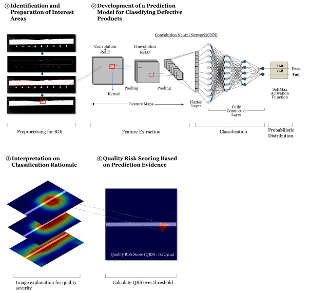
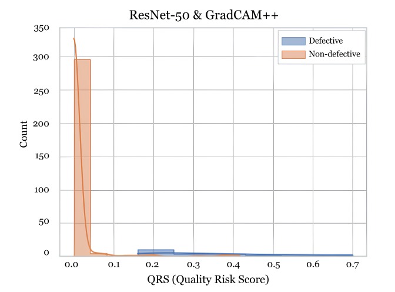
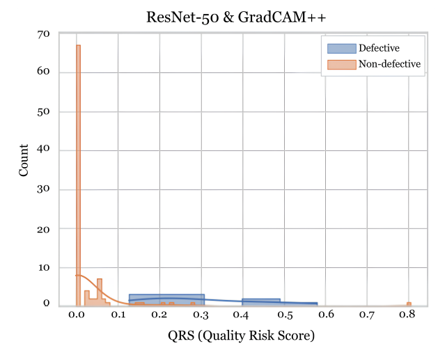

# Assessing quality risk score for advanced vision inspection based on explainable artificial intelligence

***The code will be released after publication.***

## Overview


## Preparation
### Environments
```
pip install -r requirements.txt
```

### Dataset
**Semiconductor die dataset cannot be disclosed due to considerations of security and confidentiality.**

Kolektor Surface-Defect Dataset 2: [KolektorSDD2/KSDD2](https://www.vicos.si/resources/kolektorsdd2/)

Sensum Solid Oral Dosage Forms: [Sensum SODF](https://www.sensum.eu/sensumsodf-dataset/)


## Usage
This is an example of running QRS on KSDD2 dataset.

### Data Preprocessing
The original shapes of the KSDD2 and SODF datasets were not compatible with the pretrained models, so some preprocessing was required. The raw data was converted to a shape of (224, 224, 3) and the coordinates of the original images were stored as relative coordinates. This processing can be executed using the following code:
```bash
python preprocessing.py
```

### Training Models
A ResNet model that distinguishes between defective and non-defective can be executed using the following code:
```bash
python train.py \
  --data_root ./datasets/KSDD \
  -- num_epochs 100 \
  -- batch_size 64 \
  -- learning_rate 0.0001 \
  -- patience 10 \
  -- best_loss_path ./datasets/KSDD/ResNet_best_loss.pt \
  -- best_acc_path ./datasets/KSDD/ResNet_best_acc.pt
```
### Extracting QRS
Computing Grad-CAM++ weights and deriving QRS is executed using the following code:
```bash
python extract_QRS.py \
  -- data_dir ./datasets/KSDD \
  -- model_path ./datasets/KSDD/ResNet_best_loss.pt \
  -- coords_path ./datasets/KSDD/ksdd_coords.pkl \
  -- output_prefix gradcam_weights \
  -- excel_prefix over_0.9_weights \
  -- modes ["train", "test"] \
  -- batch_size 1 \
  -- num_workers 4 \
  -- threshold 0.9 \
  -- img_size [224, 224]
```

## Main results
### Performance Metrics (F1-score)
| Dataset      | KSDD   | SODF   |
|--------------|--------|--------|
| Best loss.pt | 0.9647 | 0.9160 |
| Best acc.pt  | 0.9724 | 0.8867 |

### QRS Analysis
| Dataset   | KSDD                                   | SODF                                   |
|-----------|----------------------------------------|----------------------------------------|
| P-value   | 7.48 ×10−11                            | 0.0002                                 |
| Dist plot |  |  |


## License

This project is licensed under the MIT License. See the [LICENSE](./LICENSE) file for details.
